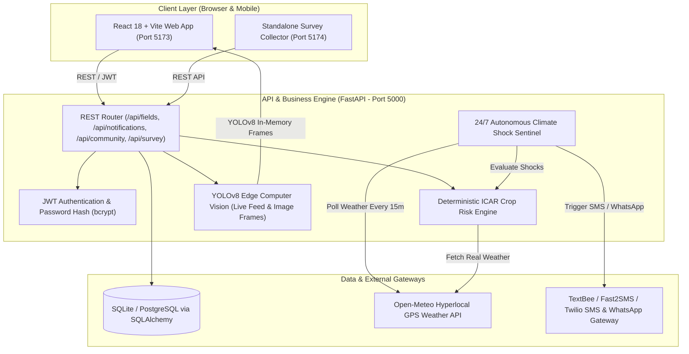

<div align="center">

# 🦅 FarmHawk 2.0

### Autonomous Precision Agriculture, Aerial Drone Vision & Hyperlocal Climate Intelligence

[](https://fastapi.tiangolo.com/)
[](https://react.dev/)
[-00FFFF.svg?style=flat&logo=ultralytics>)](https://ultralytics.com/)
[](LICENSE)
[](#-bilingual-ui--farmer-accessibility)
[](#)

_An independent, open-source agricultural intelligence platform built specifically for smallholder farmers — combining GPS field profiling, deterministic crop disease risk models, 24/7 autonomous climate sentinel alerts, YOLOv8 aerial drone computer vision, and peer-to-peer knowledge sharing._

---

</div>

## 📌 Table of Contents

- [Executive Summary](#-executive-summary)
- [Key Features & Capabilities](#-key-features--capabilities)
  - [1. GPS Field Mapping & Agronomic Profiles](#1-gps-field-mapping--agronomic-profiles)
  - [2. Hyperlocal Meteorological Intelligence](#2-hyperlocal-meteorological-intelligence)
  - [3. Deterministic ICAR-Calibrated Crop Risk Engine](#3-deterministic-icar-calibrated-crop-risk-engine)
  - [4. 24/7 Autonomous Climate Shock Sentinel](#4-247-autonomous-climate-shock-sentinel)
  - [5. Interactive Weather Shock Simulator](#5-interactive-weather-shock-simulator)
  - [6. Aerial Drone Computer Vision & Live Stream Analysis](#6-aerial-drone-computer-vision--live-stream-analysis)
  - [7. Krishi Samvad (Farmer-to-Farmer Community)](#7-krishi-samvad-farmer-to-farmer-community)
  - [8. Empirical Farmer Field Survey & Ground Insights](#8-empirical-farmer-field-survey--ground-insights)
  - [9. Verified Government Schemes & Portals](#9-verified-government-schemes--portals)
- [System Architecture](#-system-architecture)
- [Project Directory Structure](#-project-directory-structure)
- [Installation & Quickstart Guide](#-installation--quickstart-guide)
  - [Prerequisites](#prerequisites)
  - [1. Backend Setup](#1-backend-setup)
  - [2. Main Frontend Setup](#2-main-frontend-setup)
  - [3. Standalone Field Survey App Setup](#3-standalone-field-survey-app-setup)
- [Environment Variables & Gateways](#-environment-variables--gateways)
- [Feasibility, Regulatory & Compliance](#-feasibility-regulatory--compliance)
- [Contributing](#-contributing)
- [License](#-license)

---

## 🌾 Executive Summary

Smallholder farmers (operating under 2 hectares) comprise **86% of India's agricultural workforce**, yet they suffer **₹90,000 Crore annually in preventable crop losses** due to delayed disease identification, unseasonal weather shocks, and lack of timely expert intervention. Furthermore, over **$4.25 Billion** is wasted annually on indiscriminate chemical spraying.

**FarmHawk 2.0** solves this through a zero-paid-API, privacy-first, field-calibrated precision software ecosystem. It bridges the gap between complex meteorological satellite data, drone vision intelligence, and practical on-ground farming action.

---

## 🚀 Key Features & Capabilities

### 1. GPS Field Mapping & Agronomic Profiles

- **Interactive Boundary Pinning:** Leaflet.js map integration allows farmers to pin coordinates, define acreages, specify soil types (alluvial, clay, black, sandy loam), and configure irrigation systems (drip, sprinkler, flood).
- **Crop Phenology Tracking:** Tracks sowing dates, calculates growth stages (e.g. Tillering, Heading, Anthesis for Wheat), and dynamically customizes advisory thresholds.
- **Persistent Data Management:** Relational SQL storage (`farmhawk.db` via SQLAlchemy) with clean state persistence across browser reloads.

### 2. Hyperlocal Meteorological Intelligence

- **Coordinate-Exact Observations:** Fetches live temperature, relative humidity, precipitation rate, wind speed, atmospheric pressure, and dew points directly for the field's GPS via the Open-Meteo API.
- **24-Hour & 7-Day Forecasts:** Hourly trend graphs for temperature, precipitation probability, and wind velocity to plan spraying and irrigation windows.

### 3. Deterministic ICAR-Calibrated Crop Risk Engine

- **Explainable Biological Rules:** Unlike opaque "black-box" models, FarmHawk's risk engine is calibrated against **ICAR** and **NIPHM** pathogen incubation tables.
- **Disease & Pest Threat Models:** Evaluates disease risks (e.g., _Yellow Rust_, _Karnal Bunt_, _Late Blight_, _Powdery Mildew_) and insect pests (_Aphids_, _Armyworms_, _Stem Borers_) by matching real temperature/humidity conditions with crop growth sensitivity.
- **Actionable Prescriptions:** Provides organic bio-pesticide, neem oil, and chemical remedy dosages alongside preventive cultivation advice.

### 4. 24/7 Autonomous Climate Shock Sentinel

- **Autonomous Background Daemon:** A background task continually evaluates weather metrics across all registered fields every 15 minutes.
- **Instant Shock Detection:**
  - 🌧️ **Heavy Rainfall / Flash Flood:** $\ge 5.0\text{ mm/h}$ downpours (dispatches drainage & irrigation halt advisories).
  - ☀️ **Extreme Heatwave:** $\ge 38^\circ\text{C}$ temperature spikes (advises evening sprinkler cooling & anti-transpirant measures).
  - ❄️ **Cold Snap & Ground Frost:** $\le 4^\circ\text{C}$ freezing risk (advises boundary smoke mulching & light night watering).
  - 🌫️ **Fungal Microclimate:** $\ge 85\%$ humidity in $15^\circ\text{C}-30^\circ\text{C}$ range (triggers spore incubation warnings).
  - 💨 **Gale Storm:** $\ge 35\text{ km/h}$ high-velocity winds (advises lodging protection and postponement of spraying).
- **Multi-Channel Dispatch:** Dispatches bilingual alerts directly to the farmer's registered phone via **TextBee**, **Fast2SMS**, or **Twilio**, complete with an intelligent 4-hour cooldown mechanism to prevent message fatigue.

### 5. Interactive Weather Shock Simulator

- **Live Test Suite:** Built directly into the field dashboard to test alerts using simulated dummy weather shocks (`HEAVY_RAIN`, `HEATWAVE`, `FROST_WARNING`, `FUNGAL_RISK`, `STORM_WIND`).
- **Dynamic Recipient Routing:** Verify instant live SMS delivery to any custom or registered mobile number with zero friction.

### 6. Aerial Drone Computer Vision & Live Stream Analysis

- **Local YOLOv8 Architecture:** Powered by pre-trained and fine-tuned edge models (`best_model.pt`, `disease_model.pt`, `insect_model.pt`).
- **Real-Time Video Stream Processing:** Accepts RTSP/HTTP drone camera feeds, highlights detected leaf lesions and pest clusters with colored bounding boxes, and generates instant threat logs.
- **Zero Cloud API Costs:** Full local inference on CPU or GPU without per-frame API charges.

### 7. Krishi Samvad (Farmer-to-Farmer Community)

- **Peer Collaboration:** Discussion forum where farmers can post crop issues, share foliage photos, and discuss regional field trials.
- **Category Filtering:** Filter discussions by crop (Wheat, Rice, Cotton, Sugarcane, Vegetables, Organic Farming) and state.
- **Reputation & Expert Badges:** Verified agronomists and active farmer contributors receive badges and reputation points.
- **Daily Agricultural News:** Integrated regional agricultural news, mandi prices, and government advisories.

### 8. Empirical Farmer Field Survey & Ground Insights

- **15-Question Structured Research:** Based on field research with smallholder farmers capturing pesticide costs, climate shocks, and drone adoption barriers.
- **Interactive Analytics Portal:** Visual charts and statistics (86% smallholder, 60%+ input savings demand, 75% early warning need, 68% drone willingness).
- **Standalone Mobile Survey App:** Dedicated responsive web app (`survey/`) running on port `5174` for field enumerators and farmers to log responses.

### 9. Verified Government Schemes & Portals

- **Curated Policy Directory:** Instant access to verified information on **PM-KISAN**, **PMFBY** (Crop Insurance), **Kisan Credit Card (KCC)**, **Soil Health Card**, **e-NAM**, and **PM-KUSUM** (Solar Agriculture).
- **Transparent Disclaimers:** Official external links with clear disclaimers ensuring farmers verify guidelines on official portals (`pmkisan.gov.in`, `agricoop.gov.in`, `icar.org.in`).

---

## 🌐 Bilingual UI & Farmer Accessibility

- **Hindi-First Design:** Entire user interface supports clean, fluent Hindi (`hi`) and English (`en`) with instantaneous 1-click toggling.
- **Visual Iconography:** High-contrast color-coded badges, risk meters, and simplified language designed for rural accessibility and low digital literacy.

---

## 🏗️ System Architecture



---

## 📂 Project Directory Structure

```
farmhawk2.0/
├── backend/
│   ├── models/                    # YOLOv8 weights (best_model.pt, combined_data.yaml)
│   ├── routes/                    # FastAPI route controllers
│   │   ├── community_routes.py    # Krishi Samvad forum API
│   │   ├── field_routes.py        # Field management & risk API
│   │   ├── notification_routes.py # SMS, WhatsApp & Simulation API
│   │   └── survey_routes.py       # Field survey analytics API
│   ├── services/                  # Core business logic & intelligence
│   │   ├── climate_monitor.py     # 24/7 Autonomous weather sentinel
│   │   ├── live_feed_service.py   # Drone live stream processing
│   │   ├── notification_service.py# Multi-gateway SMS dispatcher
│   │   ├── risk_engine.py         # ICAR biological crop risk models
│   │   └── weather_service.py     # Open-Meteo GPS weather connector
│   ├── auth.py                    # JWT authentication & security
│   ├── database.py                # SQLAlchemy DB engine (farmhawk.db)
│   ├── db_models.py               # ORM database models
│   ├── schemas.py                 # Pydantic request/response schemas
│   ├── requirements.txt           # Python dependencies
│   └── server.py                  # Master FastAPI entry point
│
├── frontend/                      # Main React 18 + Vite Application
│   ├── src/
│   │   ├── assets/                # Logos, illustrations & photographic assets
│   │   ├── components/            # Reusable UI components & modals
│   │   │   ├── CreateFieldModal.jsx
│   │   │   ├── CreateProfileModal.jsx
│   │   │   ├── FieldMap.jsx       # Leaflet.js interactive GPS map
│   │   │   └── LiveFeedView.jsx   # Real-time drone stream viewer
│   │   ├── pages/                 # Main page views
│   │   │   ├── AboutPage.jsx      # Features, research & mission
│   │   │   ├── CommunityPage.jsx  # Krishi Samvad forum
│   │   │   ├── DashboardPage.jsx  # Overview & farm statistics
│   │   │   ├── LoginPage.jsx      # Farmer sign-in & onboarding
│   │   │   ├── SelectedFieldPage.jsx # Deep-dive field intelligence
│   │   │   └── SurveyInsightsPage.jsx# 15-question research charts
│   │   ├── services/              # Frontend API client (api.js)
│   │   ├── styles/                # Modular CSS stylesheets
│   │   ├── App.jsx                # Router & state persistence
│   │   └── main.jsx
│   ├── package.json
│   └── vite.config.js
│
├── survey/                        # Standalone 15-Question Field Survey App
│   ├── src/                       # Lightweight mobile-first survey form
│   ├── package.json
│   └── vite.config.js             # Configured for port 5174
│
└── README.md                      # Master Project Documentation
```

---

## ⚙️ Installation & Quickstart Guide

### Prerequisites

- **Python:** `3.10` or higher (`3.11` / `3.12` recommended)
- **Node.js:** `v18.0.0` or higher
- **npm:** `v9.0.0` or higher
- **Git**

---

### 1. Backend Setup

```bash
# 1. Navigate to the backend directory
cd backend

# 2. (Optional) Create and activate a Python virtual environment
python -m venv venv

# Windows:
venv\Scripts\activate
# Linux/macOS:
# source venv/bin/activate

# 3. Install required Python packages
pip install -r requirements.txt

# 4. Start the FastAPI backend server
python server.py
```

> The backend server will initialize SQLite database tables (`farmhawk.db`), start the 24/7 autonomous climate monitor daemon, and listen on **`http://localhost:5000`**.  
> Interactive OpenAPI documentation is accessible at **`http://localhost:5000/docs`**.

---

### 2. Main Frontend Setup

```bash
# 1. Open a new terminal and navigate to the frontend directory
cd frontend

# 2. Install Node dependencies
npm install

# 3. Start the Vite development server
npm run dev
```

> The main web application will start at **`http://localhost:5173`**.

---

### 3. Standalone Field Survey App Setup

```bash
# 1. Open a new terminal and navigate to the survey directory
cd survey

# 2. Install Node dependencies
npm install

# 3. Start the survey app on port 5174
npm run dev -- --port 5174
```

> The survey data collection app will start at **`http://localhost:5174`**.

---

## 🔑 Environment Variables & Gateways

You can configure SMS and notification gateways by setting environment variables in `backend/.env` or configuring them in the live dashboard settings:

| Variable              | Description                     | Default / Example     |
| :-------------------- | :------------------------------ | :-------------------- |
| `TEXTBEE_API_KEY`     | TextBee Android SMS Gateway Key | `txb_...`             |
| `TEXTBEE_DEVICE_ID`   | Registered Android Device ID    | `6a9854...`           |
| `FAST2SMS_API_KEY`    | Fast2SMS Bulk SMS Gateway Key   | `optional`            |
| `TWILIO_ACCOUNT_SID`  | Twilio Account SID              | `optional`            |
| `TWILIO_AUTH_TOKEN`   | Twilio Auth Token               | `optional`            |
| `TWILIO_PHONE_NUMBER` | Twilio Outbound Number          | `optional`            |
| `JWT_SECRET_KEY`      | Secret for JWT Token Signing    | `farmhawk-secret-key` |
| `CORS_ORIGINS`        | Permitted Frontend Origins      | `*`                   |

---

## ⚖️ Feasibility, Regulatory & Compliance

1. **DGCA Drone Regulations 2021 (India):**
   - Agricultural micro-drones under 10 kg operating below 400 ft AGL in designated **Green Zones** require no prior air traffic control clearance. FarmHawk serves as the software and analytical intelligence layer.
2. **Digital Personal Data Protection Act (DPDPA 2023):**
   - Stores strictly agricultural metadata (GPS field boundaries, crop variety, sowing date) and mobile contact numbers for alert delivery. Zero biometric or sensitive banking data is collected.
3. **No Paid AI Lock-in:**
   - Zero ongoing per-query API bills. All computer vision and deterministic risk calculations run locally on open-source frameworks.

---

## 🤝 Contributing

Contributions, feedback, and regional crop rule enhancements are warmly welcomed!

1. Fork the Project repository.
2. Create your Feature Branch (`git checkout -b feature/NewCropModel`).
3. Commit your Changes (`git commit -m 'Add groundnut disease rules'`).
4. Push to the Branch (`git push origin feature/NewCropModel`).
5. Open a Pull Request.

---

## 📄 License

Distributed under the **MIT License**. See `LICENSE` for more information.

---

<div align="center">
  <strong>FarmHawk Platform</strong> • Dedicated to Farmer Empowerment & Agricultural Progress
</div>
